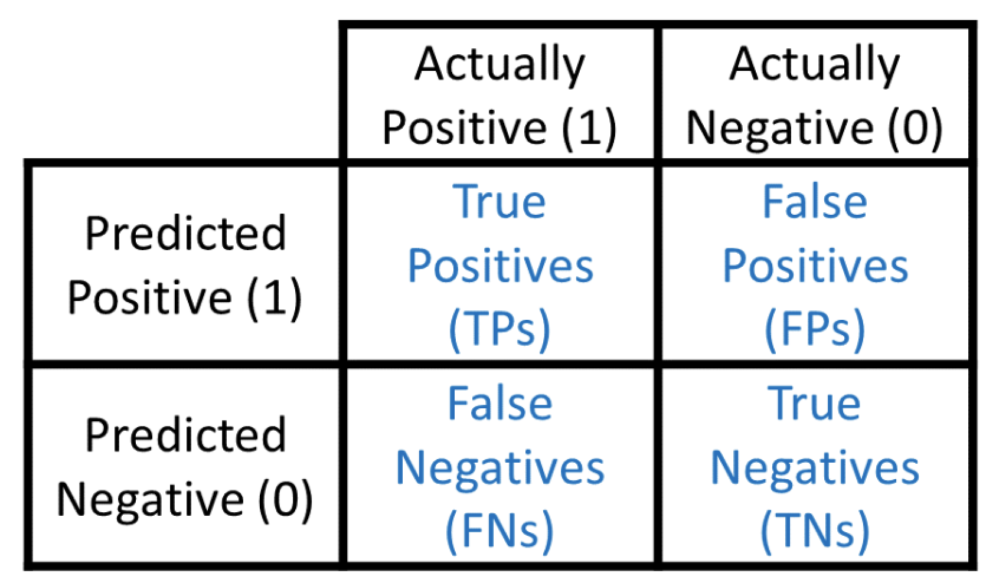
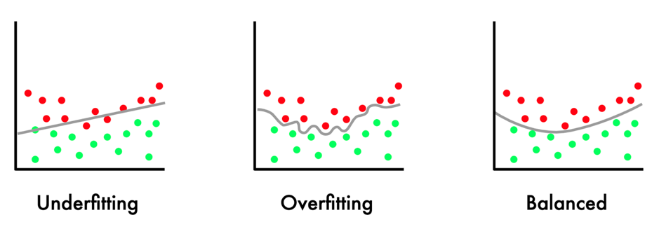
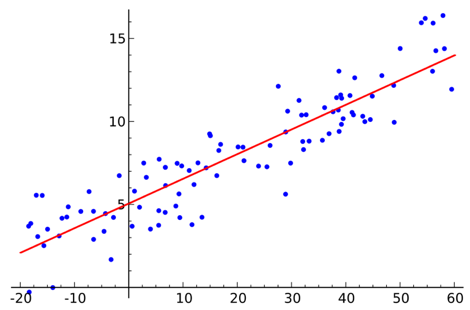
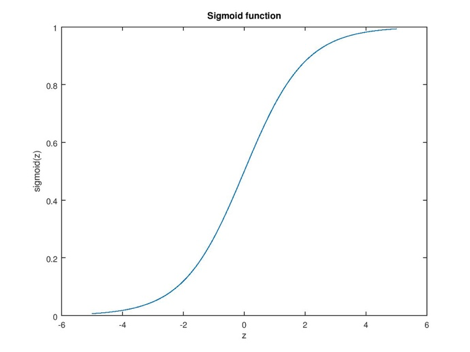

# Machine Learning 101

Machine Learning has become the baseline for majority of the intelligent systems today. Whether the application is in the domain of Artificial Intelligence or Data Science, it is considered the building block for embryonic systems in these fields. Despite its prevalence in present-day systems, the basics of Machine Learning are often confused with those of AI or Data Science. This blog is an effort to clarify what Machine Learning is about, and what it entails.

Machine Learning is generally defined as enabling computers to learn on the basis of data being fed, without being explicitly programmed. The fact that there are almost 3.9 billion internet users all over the world indicates the data being generated is humungous. To deal with massive data, Machine Learning models are highly convenient given they have optimum resources. In today’s landscape, certain factors such as huge volume of data, various varieties of data like images and audios along with cheaper and greater availibility of computational resources has led to Machine Learning become a favorite for Data Analysis and Modeling.

## Machine Learning Terminologies

When you start working on Machine Learning, one may come across various terms that would lead to confusion. This section will focus on elaborating those terms so as to give the readers an idea behind those terms.

1. Dataset

The dataset is defined as the collection of data. It can be comma separated values (csv), database or a matrix etc. Each dataset is divided into three subsets:

   a. Training set
   
   This subset is used for training the machine learning model. The parameters of the model are gauged using the training data.

   b. Test set
   
   This subset is used for assessing the machine learning model. It is independent of the training data but follows the same distribution as the training data.

   c. Cross Validation set
   
   This portion of dataset is used to compare the performances of the machine learning models that were created based on the training set. This enables us to tune the parameters of the model for better performance. The algorithm with the best performance is then chosen.

The most common approach towards separating the dataset into the above-mentioned subsets is dividing the dataset randomly into 80/20 ratio. The 80% training data is then again split into 80/20 ratio, with 20% allocated to cross validation set.

2. Cost Function

The cost function associated with every algorithm is defined as the ‘cost’ or error it incurs. It measures how wrong an algorithm is while predicting the output labels.

3.	Confusion Matrix

A confusion matrix is a visual representation of the performance of the machine learning model. It classifies all predictions into four categories and calculates various metrics e.g. precision, recall and others.

   a.	True Positives: When the predictions and actual label, both are true.
   
   b.	False Positives: When the predictions are true, but the actual label are not.
   
   c.	True Negatives: When the predictions and actual label, both are false.
   
   d.	False Negatives: When the predictions are false, but the actual label are not.
   
   

      
   

   
4.	Outliers

Outliers or anomalies are the data that does not fit to the underlying pattern of the data. 

5.	Underfitting

Underfitting occurs when the model is unable to capture the trend in underlying data. The training set error and test set error is both high, and the model is unable to generalize to new data.

6.	Overfitting

Overfitting occurs when the model performs well on training set but is unable to fit well to test data. The training set error is significantly lower than that of test set error.

   

## Machine Learning Types

The machine learning algorithms are generally divided into three types:

1.	Supervised Learning

This approach involves using a labeled dataset i.e. the output of each training example in the dataset is provided. Some examples that rely on this type of learning are Linear Regression and Decision Trees.

2. Unsupervised Learning

This approach involves using an unlabeled dataset i.e. the output of each training example in the dataset is not provided. Some examples that rely on this type of learning are K-Mean Clustering.

3. Reinforcement Learning

This approach is used when the purpose is to increase efficiency. The model interacts with the environment and then calculates the cost or reward. One of the major characteristic of this approach is training itself continuously via iterative trial and error and choosing the one with maximum performance.

## Machine Learning Algorithms

While the approaches to solving a problem statement differ, one of the most vital part is to choose the right algorithm to decipher the data. Below are the few algorithms that are most commonly used, and a great beginning step for those interested in Machine Learning.

1.	Linear Regression

Linear Regression is used to predict continuous output values. It is represented by an equation that uses ‘line of best fit’ to fit to the underlying data. The parameters determined by the model are y-intercept and the slope of the best-fit line. It is one of the oldest, simplest and fastest technique, and a good algorithm to begin with if you have just started with Machine Learning Algorithms.

   

2.	Logistic Regression

Logistic Regression is used to predict discrete values. To fit the values between 0 and 1, a sigmoid function is used. You can either use the output directly as probability or define a threshold for outputs e.g. if output is greater than 0.5, assign 1 to the label. It is also an efficient and simple algorithm.

   

3.	Decision Trees

Decision Trees solve regression and classification problems by using tree-like model for decision making. The dataset is split into smaller subsets, and the resulting tree is made up of decision nodes and leaf nodes. The leaf nodes are the output labels.

   

## Machine Learning SOMETHING

1. Pandas

Pandas is an open source python library famous for high performance data manipulation and analysis. You can access the documentation for Pandas on this link: https://pandas.pydata.org/pandas-docs/stable/index.html

2. Spark

Spark is an open source cluster computing framework, which makes data processing up to 100 times faster by eliminating time lag using parallel processing of data. You can access the documentation for Spark on this link: https://spark.apache.org/docs/latest/

3. TensorFlow

TensorFlow is Google's open source machine learning framework. It is popular among developers for designing, developing and training deep learning networks. You can access the documentation for TensorFlow on this link: https://www.tensorflow.org/guide

4. SystemML

Apache SystemML is a flexible machine learning system that automatically scales algorithms written in R or Python to big data i.e. Spark and Hadoop clusters. You can access the documentation for SystemML on this link: http://apache.github.io/systemml/

To view these terms and algorithm used in a Jupyter Notebook, please refer to https://github.com/sanamushtaque/ML-Notebook.git

All the resources and terms introduced are incredibly accessible, and can be incorporated in your algorithms by using simple **import** statements in jupyter notebooks. I hope this blog helped in clarifying concepts related to Machine Learning, and introducing some libraries and frameworks to play around with data. 

Good luck exploring machine learning!
